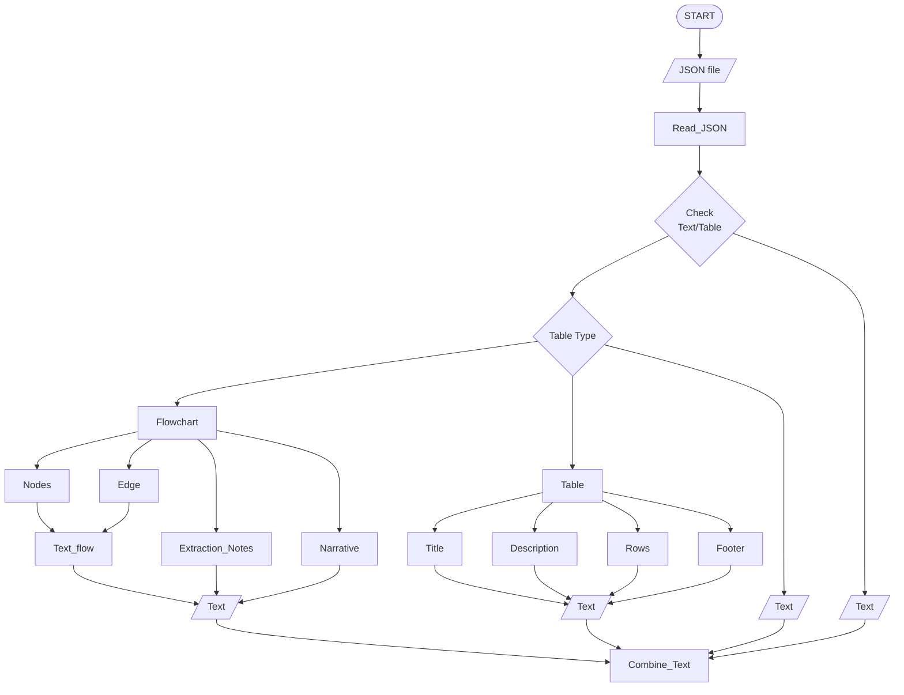

```mermaid

flowchart TB
  node_1(["START"])
  node_2[/"JSON file"/]
  node_3["Read_JSON"]
  node_4{"Check\nText/Table"}
  node_5[/"Text"/]
  node_6{"Table Type"}
  node_7[/"Text"/]
  node_8["Table"]
  node_9["Flowchart"]
  node_10["Title"]
  node_11["Description"]
  node_12["Rows"]
  node_13["Footer"]
  node_14[/"Text"/]
  node_15["Narrative"]
  node_16["Extraction_Notes"]
  node_17["Nodes"]
  node_18["Edge"]
  node_19["Text_flow"]
  node_20[/"Text"/]
  node_21["Combine_Text"]
  node_1 --> node_2
  node_2 --> node_3
  node_3 --> node_4
  node_4 --> node_5
  node_4 --> node_6
  node_6 --> node_7
  node_6 --> node_8
  node_6 --> node_9
  node_8 --> node_10
  node_8 --> node_11
  node_8 --> node_12
  node_8 --> node_13
  node_10 --> node_14
  node_11 --> node_14
  node_12 --> node_14
  node_13 --> node_14
  node_9 --> node_15
  node_9 --> node_16
  node_9 --> node_17
  node_9 --> node_18
  node_17 --> node_19
  node_18 --> node_19
  node_19 --> node_20
  node_16 --> node_20
  node_15 --> node_20
  node_20 --> node_21
  node_14 --> node_21
  node_7 --> node_21
  node_5 --> node_21

```