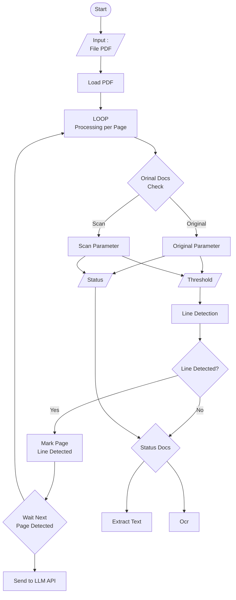

```mermaid

flowchart TB
  node_1(["Start"])
  node_2[/"Input :\nFile PDF"/]
  node_3["Load PDF"]
  node_4["LOOP\nProcessing per Page"]
  node_5{"Orinal Docs\nCheck"}
  node_6["Original Parameter"]
  node_7["Scan Parameter"]
  node_8[/"Threshold"/]
  node_9[/"Status"/]
  node_10["Line Detection"]
  node_11{"Line Detected?"}
  node_12["Mark Page\nLine Detected"]
  node_13{"Status Docs"}
  node_14{"Wait Next\nPage Detected"}
  node_15["Extract Text"]
  node_16["Ocr"]
  node_17["Send to LLM API"]
  node_1 --> node_2
  node_2 --> node_3
  node_3 --> node_4
  node_4 --> node_5
  node_5 --"Original"--> node_6
  node_5 --"Scan"--> node_7
  node_6 --> node_8
  node_7 --> node_8
  node_6 --> node_9
  node_7 --> node_9
  node_8 --> node_10
  node_10 --> node_11
  node_11 --"Yes"--> node_12
  node_11 --"No"--> node_13
  node_9 --> node_13
  node_12 --> node_14
  node_13 --> node_15
  node_13 --> node_16
  node_14 --> node_4
  node_14 --> node_17

```