flowchart TD
    A[Mulai] --> B[Buka PDF & Scan Seluruh Halaman]
    B --> C{Apakah Halaman Satu Kolom?}
    C -->|Ya| D[Ekstrak Teks Langsung]
    C -->|Tidak| E{Apakah Halaman Dua Kolom?}
    E -->|Ya| F[Pisahkan Teks Kiri dan Kanan ID & EN]
    E -->|Tidak| G{Apakah Halaman Memiliki Tabel?}
    F --> H[Ekstrak Tabel Jika Ada]
    D --> H[Ekstrak Tabel Jika Ada]
    G -->|Ya| I{Apakah Tabel Merge Cell?}
    G -->|Tidak| J[Ekstrak Tabel Normal]
    I -->|Ya| K[Ekstrak Tabel Merge Cells]
    I -->|Tidak| L[Ekstrak Tabel Normal]
    K --> M[Ekstrak OCR Jika Diperlukan]
    L --> M[Ekstrak OCR Jika Diperlukan]
    J --> M[Ekstrak OCR Jika Diperlukan]
    H --> M[Ekstrak OCR Jika Diperlukan]
    M --> N[Simpan Metadata Layout & Konten]
    N --> O[Ekstraksi Konten Sesuai Metadata]
    O --> P[Post-Processing: Hapus Duplikasi & Format]
    P --> Q[Simpan Output dalam Format JSON atau Struktural Lain]
    Q --> R[Selesai]

    
    class A,B,C,D,E,F,G,H,I,J,K,L,M,N,O,P,Q,R default;

```mermaid
graph TD;
    A(🔠Load PDF) --> B(📠Detect Layout)
    B -->|Single Column| C[🔹 Split Sections Normally]
    B -->|Multi Column| D[🔹 Split Sections by Columns]

    C --> E{📌 Detect Content Type}
    D --> E

    E -->|Text| F[Teks Biasa]
    E -->|Table| G{📌 Detect Table Type}
    E -->|Image| H{🔠Perform OCR}

    G -->|Normal| I[Tabel Normal]
    G -->|Continued| J[Tabel Berlanjut]
    G -->|Merged Cell| K[Tabel Merged Cell]

    H -->|Contains Table| L[OCR Tabel]
    H -->|No Table| M[OCR Teks]

    F --> Z(📌 Mark Page & Save Metadata)
    I --> Z
    J --> Z
    K --> Z
    L --> Z
    M --> Z

    Z -->|Next Page| A

```

```mermaid
graph TD;
    %% Step 1: Persiapan PDF dan Layout Deteksi
    A[1.1 🔠Load PDF] --> B[1.2 📠Detect Layout]

    %% Step 2: Pemisahan Halaman Berdasarkan Layout
    B -->|Single Column| C[2.1 Single Column: Split Sections]
    B -->|Multi Column| D[2.2 Multi Column: Split by Columns]

    %% Step 3: Deteksi Jenis Konten
    C --> E[3.1 📌 Detect Content Type per Section]
    D --> E
    E -->|Text| F[3.2 Teks Biasa]
    E -->|Table| G[3.3 📌 Detect Table Type]
    E -->|Image| H[3.4 OCR Teks atau Tabel]
    
    %% Step 4: Deteksi Tabel
    G -->|Normal| I[4.1 Tabel Normal]
    G -->|Continued| J[4.2 Tabel Berlanjut]
    G -->|Merged Cell| K[4.3 Tabel Merged Cell]
    
    %% Step 5: OCR Teks
    H -->|Teks| L[5.1 OCR Teks]
    H -->|Tabel| M[5.2 OCR Tabel]

    %% Step 6: Marking dan Metadata
    F --> Z[6.1 📌 Mark Page & Save Metadata]
    I --> Z
    J --> Z
    K --> Z
    L --> Z
    M --> Z

    Z -->|Next Page| A

```

